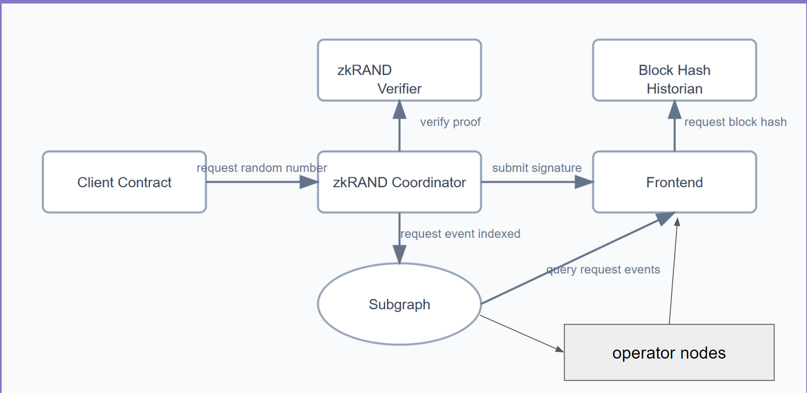

  
  <h1 style="margin: 0; padding-left: 10px;">ZKRand</h1>

A verifiable random number generation system for Citrea chain using zero-knowledge proofs (zk).

## ⚠️  Note
>  This project is based on ZKVRF and has been completely rewritten using the Circom programming language.

[Demo](https://youtu.be/gyRgzEJfRxo])  
## Overview

ZKRand is a specialized deterministic public-key cryptographic system that leverages zk-SNARK technology through Circom to provide verifiable random numbers. The system is designed to serve decentralized applications on the Citrea chain, particularly for use cases such as:

- NFT minting
- Lotteries
- Raffles
- Sweepstakes
- Games

## Key Features

### Secure Randomness Properties

- **Unpredictability**: Random numbers cannot be guessed in advance
- **Impartiality**: Results are generated without bias
- **Auditability**: The random number generation process is fully verifiable
- **Consistency**: Reliable availability when needed

### Technical Advantages

- **Universal Access**: Generate random numbers directly through a web browser
- **No Special Software**: Works with standard web browsers
- **EVM Compatibility**: Functions on any Ethereum Virtual Machine network with EC precompile support

## Benefits

ZKRand addresses the common trade-offs found in current randomness technologies by providing a balanced solution that optimizes:

- Availability
- Cost efficiency
- Bias resistance
- System uptime

## Working

   

The process begins with a **client (consumer contract)** requesting a random number. The request is processed by the **ZKRANDOM coordinator**, indexed in the **subgraph**, and monitored by the **ZKRANDOM Explorer** frontend. Operators generate and submit proofs back to the coordinator, which verifies the proof and delivers the random number to the client.  

---

#### Process Flow  

1. The **client** submits a **random number request** to the **ZKRANDOM coordinator**.  
2. The request is **indexed** in the **subgraph**, making it visible to the **ZKRANDOM Explorer** (frontend).  
3. An **operator** observes the request from the explorer, generates a proof, and submits it back to the **coordinator**.  
4. The **coordinator** verifies the proof using the **ZKRANDOM UltraPlonk verifier**.  
5. Once the proof is verified, the **random number** is sent back to the **client**.  

---

#### Key Components  

1. **ZKRANDOM Coordinator**  
   - Manages random number requests.  
   - Verifies proofs submitted by operators.  
   - Sends the random number to the client after verification.  

2. **ZKRANDOM UltraPlonk Verifier**  
   - Ensures the cryptographic integrity of proofs submitted by operators.  

3. **Subgraph**  
   - Indexes random number requests for event monitoring.  
   - Provides request data to the ZKRANDOM Explorer.  

4. **ZKRANDOM Explorer**  
   - A frontend interface to track random number requests.  
   - Allows operators to observe pending requests.  

5. **Operator**  
   - A key participant responsible for generating ZKRANDOM proofs based on requests.  

---

#### Key Interactions  

#### Between Components  

- **Client ↔ Coordinator**:  
  - The client sends a **random number request** to the coordinator.  
  - The coordinator responds with the **random number** after proof verification.  

- **Coordinator ↔ Subgraph**:  
  - The coordinator emits a **request event** to the subgraph for indexing.  

- **Subgraph ↔ ZKRANDOM Explorer**:  
  - The ZKRANDOM Explorer queries the subgraph to display **pending requests**.  

- **Operator ↔ Coordinator**:  
  - The operator submits a **ZKRANDOM proof** to the coordinator for verification.  

- **Coordinator ↔ Verifier**:  
  - The coordinator interacts with the verifier to **verify proofs** submitted by operators.  

---

## Technology Stack

- **Core Technology**: zk-SNARK
- **Development Framework**: Noir
- **Implementation**: Programmable cryptography
- **Network**: Citrea chain
- **Architecture**: Deterministic public-key cryptographic system

## Usage

Users can generate verifiable random numbers through a simple web interface, making it accessible for both developers and end-users of decentralized applications.

## Target Applications

ZKRand is particularly suitable for blockchain applications requiring fair and verifiable randomness, including:

- Decentralized gaming platforms
- NFT distribution systems
- Fair lottery implementations
- Random selection mechanisms
- Chance-based smart contracts

## Technical Requirements

- Compatible EVM network
- EC precompile support
- Web browser for interaction

## Live contracts addresses

Verifier [0x2ae470412F8b53E263C8F967E9679e4830a2643A](https://explorer.testnet.citrea.xyz/address/0x2ae470412F8b53E263C8F967E9679e4830a2643A)  
ZKrand [0xF12977Ff3F3260C36774ae47bd85Ca08D4878533](https://explorer.testnet.citrea.xyz/address/0xF12977Ff3F3260C36774ae47bd85Ca08D4878533)  

 
